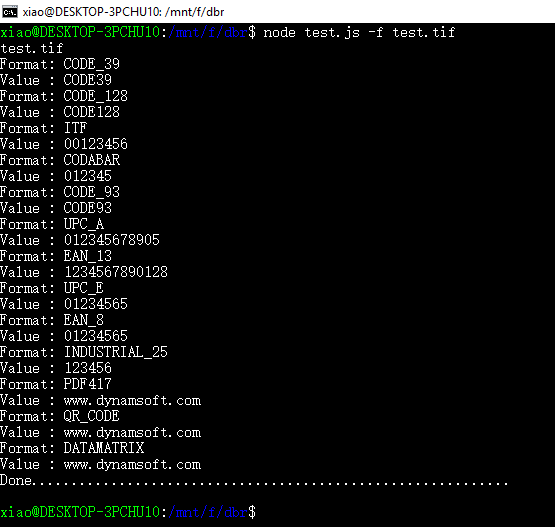

# Linux Barcode SDK Wrapper for Node.js
Build the **Node.js** extension with Dynamsoft Barcode Reader SDK for Linux. Create server-side barcode reader apps using JavaScript.

## Environment
* Node 8.4.0
* Npm 5.3.0
* Dynamsoft Barcode SDK 5.2. Please contact support@dynamsoft.com to get the beta version and trial license.

## How to Build the Extension 
1. Create symlink for libDynamsoftBarcodeReaderx64.so:

    ```
    sudo ln -s <Your PATH>/libDynamsoftBarcodeReaderx64.so /usr/lib/libDynamsoftBarcodeReader.so
    ```

2. Install **node-gyp**:

    ```
    npm install -g node-gyp
    ```

3. Configure building environment:

    ```
    node-gyp configure
    ```

4. Build the extension:

    ```
    node-gyp build
    ```

5. Run the test app:

    ```
    node test.js -f test.tif
    ```
    


